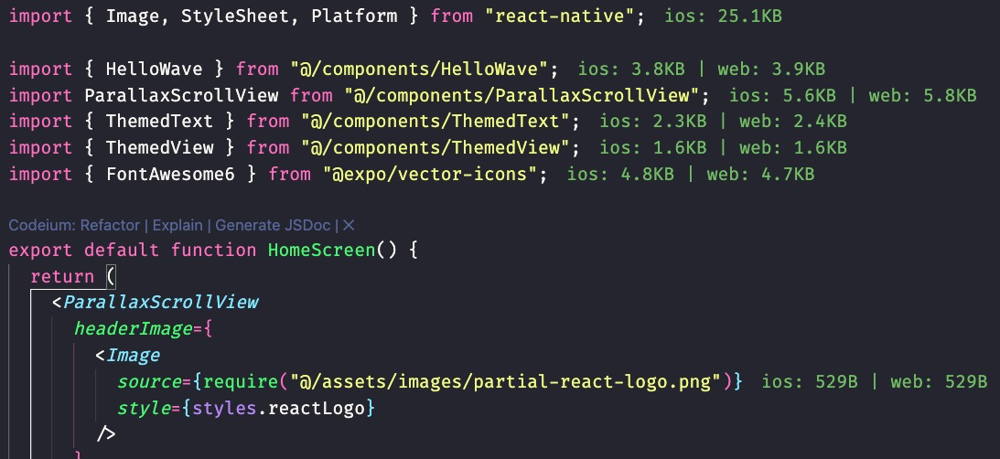

# Expo Import Cost VSCode Extension

This extension will display inline in the editor the size of the imported package and file. The extension utilizes [expo-atlas](https://github.com/expo/atlas) in order to detect the imported size

This extension is based on [expo-atlas](https://github.com/expo/atlas) and inspired by [wix's import cost extension](https://github.com/wix/import-cost/tree/master/packages/vscode-import-cost).

## Installation

1. Go to the [Releases](https://github.com/SohelIslamImran/expo-import-cost/releases) and download the [`expo-import-cost.vsix`](https://github.com/SohelIslamImran/expo-import-cost/releases/download/v0.0.1/expo-import-cost-0.0.1.vsix) file from Assets

2. Then go to VSCode > Extensions tab, click on the three dots and click on "install from VSIX..." and then select the downloaded `expo-import-cost.vsix` file.

## Features

Calculates the size of imports and requires. Supports both `Javascript` and `Typescript`



## Requirements

This extension require [Expo Atlas](https://docs.expo.dev/guides/analyzing-bundles/#using-atlas-with-npx-expo-start) to be enabled. Atlas is built into Expo starting from SDK 51, and enabled when defining the environment variable `EXPO_UNSTABLE_ATLAS=true`.

```bash
$ EXPO_UNSTABLE_ATLAS=true npx expo start
```

> [!TIP]
> Expo start runs in development mode by default. If you want to see a production bundle of your app, you can start the local dev server in production mode: `$ expo start --no-dev`.

Follow the documentation for more guide: https://docs.expo.dev/guides/analyzing-bundles/#using-atlas-with-npx-expo-start

Then start your project for any platform `$ expo start -p ios | android | web`

## Extension Settings

You can toggle this extension to show or hide by `Shift+Cmd+P` and `Toggle Expo Import Cost`

---

**Enjoy!**
